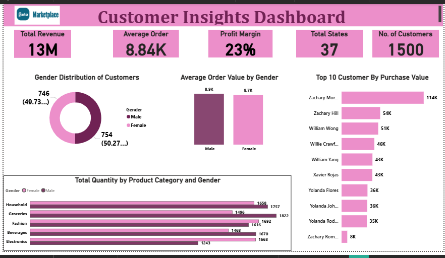
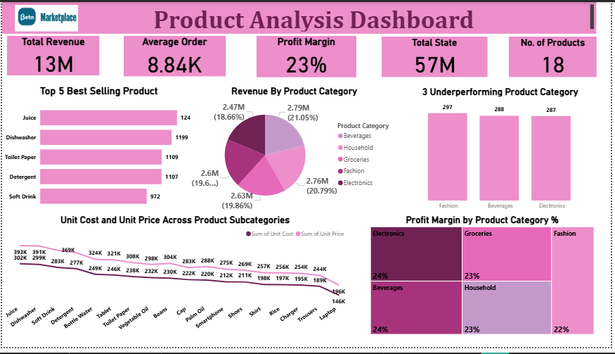
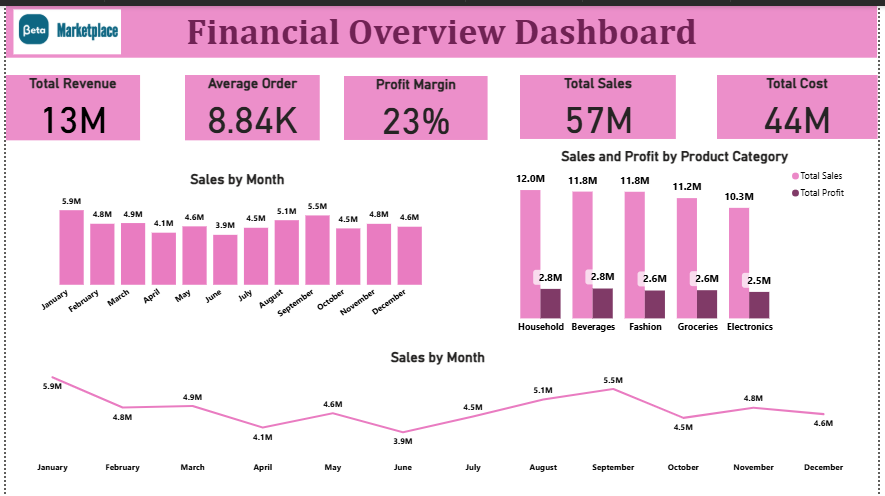
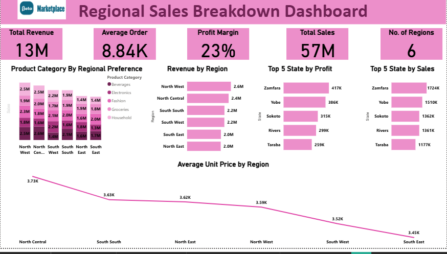

# Beta-Marketplace-Sales-Analysis

##  Project Overview  
This project presents a comprehensive analysis of **Beta Marketplace**, an online shopping platform, using **Power BI**. The purpose of this analysis is to provide actionable insights into sales performance, product profitability, customer behavior, and regional distribution.  

The dashboard is designed to support strategic decision-making by identifying high-performing areas, revealing underperforming segments, and uncovering opportunities for business growth.  

---

##  Business Objectives and Questions  
The analysis seeks to address the following key business questions:  

1. What are the overall sales trends and profit performance across product categories?  
2. Which regions generate the highest sales and profit?  
3. Who are the top-performing customers, and what are their purchasing behaviors?  
4. Which product categories or subcategories are underperforming?  
5. How can marketing, supply, and sales strategies be optimized for better performance?  

---

##  Tools and Methodology  

**Tool Used:** Power BI  
**Data Source:** Beta Marketplace Dataset  

**Methodology Steps:**  
- **Data Cleaning and Preparation:** Ensured data consistency by removing duplicates, handling missing values, and validating transaction records.  
- **Data Modeling:** Established relationships among tables (Sales, Products, Customers, and Regions) to enable cross-functional analysis.  
- **KPI Development:** Created DAX measures for Total Sales, Total Profit, Profit Margin, Average Order Value, and Total Quantity Sold.  
- **Dashboard Design:** Developed interactive and visually driven dashboards that allow stakeholders to explore key performance metrics and insights.  

---

##  Dashboard Overview  

The Power BI dashboard is divided into four major analytical sections:  

1. **Financial Overview:** Monthly sales trends and sales/profit analysis across product categories.  
2. **Regional Sales Insights:** Revenue and profit by region, top-performing states, and category preferences by region.  
3. **Customer Insights:** Gender distribution, average order value by gender, and top 10 customers by purchase volume.  
4. **Product Analysis:** Top 5 selling products, revenue, and profit margin by category, and analysis of underperforming categories.  

### Dashboard Snapshots  

 
- 
  
- 
  
- 
  
- 

---

##  Key Insights  

- **Sales Performance:** Sales fluctuated throughout the year, with a noticeable drop in June — the lowest-performing month.  
- **Regional Distribution:** The **North-West region** recorded the highest revenue and profit, indicating a strong market presence.  
- **Customer Analysis:** Distinct purchasing behaviors were observed between genders, with notable variations in product category preferences.  
- **Product Performance:** The top 5 products significantly outperformed others, while **electronics, beverages, and fashion** categories exhibited weak performance.  
- **Customer Value:** A limited number of high-value customers contributed substantially to total sales, emphasizing the importance of retention strategies.  

---

##  Recommendations  

1. **Increase Supply in the North-West Region**  
   - Expand inventory and marketing initiatives to sustain and capitalize on the region’s strong demand.  

2. **Boost Underperforming Categories**  
   - Implement targeted advertising and promotional campaigns for **electronics, beverages, and fashion** to enhance visibility and sales.  

3. **Stimulate Sales During Low-Performing Months (June)**  
   - Introduce promotional discounts, bundled offers, or loyalty rewards to drive engagement and sales volume.  

4. **Leverage High-Value Customers**  
   - Develop a customer retention strategy through loyalty programs, referral bonuses, and personalized offers.  

---

##  Conclusion  

The **Beta Marketplace Power BI Dashboard** provides a data-driven foundation for strategic planning and operational improvement.  
By integrating key performance indicators across sales, products, customers, and regions, the analysis enables management to make informed decisions on inventory planning, marketing allocation, and customer engagement strategies.  

The insights and recommendations from this project aim to guide Beta Marketplace toward improved sales performance, enhanced customer satisfaction, and sustainable business growth.  

---

## Appendix  
**Author:** Odey Peace Ogeyi  
**Role:** Data Analyst | Power BI Developer  
**Tools Used:** Power BI, Microsoft Excel, DAX  
**Contact:** [Your LinkedIn Profile or Email Address]  

---

